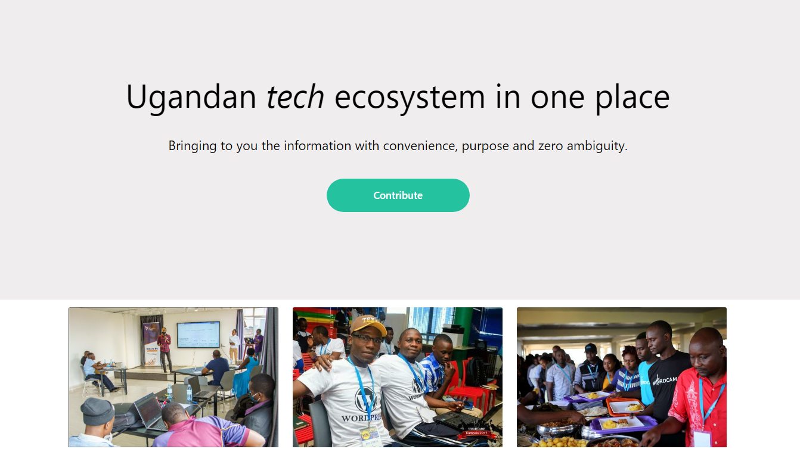

### Tech Spaces Uganda.

This repository contains information about the developer communities in Ugannda.



#### Installation Guidelines

1. Fork this repo. Please be sure to use the current _main_ branch as your starting point:

```bash

   https://github.com/morelmiles/techspaces-uganda

```

2. You'll be redirected to:

```bash

https://github.com/your-username/techspaces-uganda

```

3. Clone it the repository:

```bash

git clone https://github.com/your-username/techspaces-uganda.git

```

4. Install the project dependencies:

```bash
npm i

or

yarn add

```

5. Open in the text editor of your choice
6. Create New Branch:

```bash

   cd techspaces-uganda
   git branch new-branch
   git checkout new-branch

```

7. Make your edits locally:

```bash

   git add -A

```

8. Commit the changes:

```bash

   git commit -m "Commit Message Here"

```

9. Submit a pull request:

```bash

   git push --set-upstream origin new-branch-name

```
